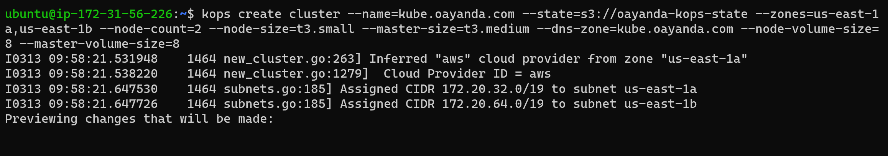
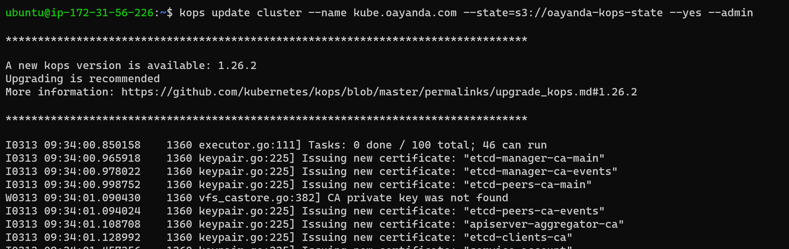
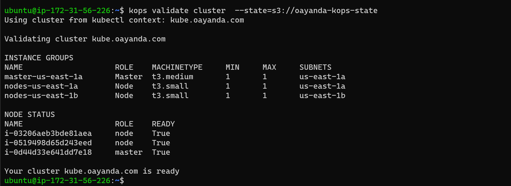
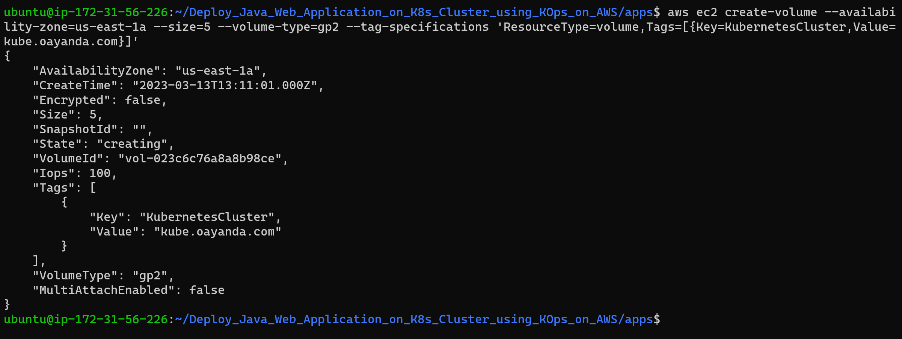
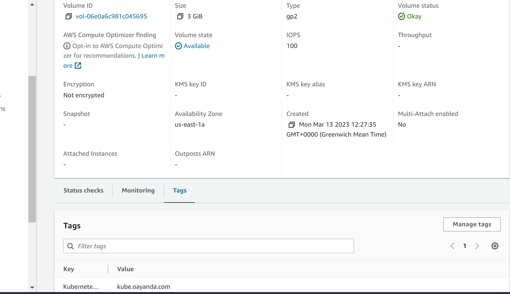
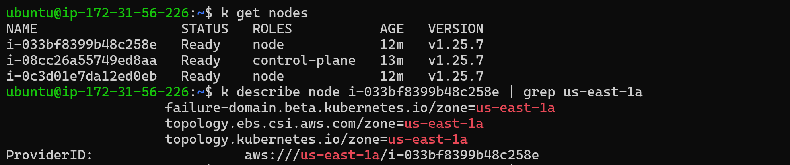
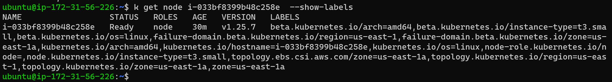
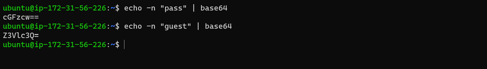
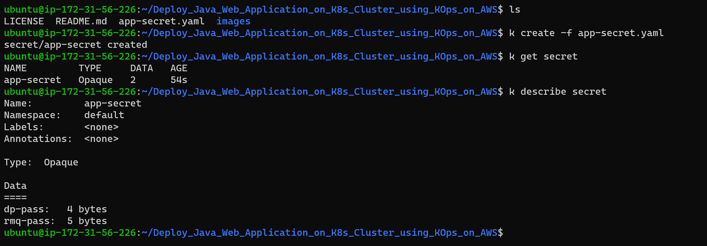

# Deploy Java Web Application on K8s Cluster using KOps on AWS.

Prerequites

AWSCLI
## Spin up KOps Cluster

Create cluster

```bash
kops create cluster --name=kube.oayanda.com --state=s3://oayanda-kops-state --zones=us-east-1a,us-east-1b --node-count=2 --node-size=t3.small --master-size=t3.medium --dns-zone=kube.oayanda.com
```



Update cluster

```bash
 kops update cluster --name kube.oayanda.com --state=s3://oayanda-kops-state --yes --admin
```



Validate cluster

```bash
kops validate cluster  --state=s3://oayanda-kops-state
```



Create Persistent Volume for DB Node and copy the volume ID for later use. *vol-023c6c76a8a8b98ce* and the AZ *us-east-1a*.

```bash
aws ec2 create-volume --availability-zone=us-east-1a --size=5 --volume-type=gp2 --tag-specifications 'ResourceType=volume,Tags=[{Key=KubernetesCluster,Value=kube.oayanda.com}]'
```

> ***Note:** For volume mapping, make sure the value of the tag is the same as your k8scluster.*



Verfiy from AWS console



Verify the node in us-east-1a

```bash

# Get available Nodes
k get nodes

# Get more details about a node using the name
k describe node <name>
```



Create custome labels for nodes

```bash
# Create label for node
k label nodes i-033bf8399b48c258e zone=us-east-1a

# Verify label creation
k get node i-033bf8399b48c258e --show-labels
```



## Writing Defination Files

View Docker images for application here oayanda/vprofileapp:v1
oayanda/vprofiledb:v1

***Secret Defination File***

Encode for the application and rabbitmg passwords with base64.

```bash
echo -n "<password>" | base64
```



Create Secret and deploy object

```bash
# create secret object
k create -f app-secret.yaml

# Show secret
k get secret
```

> ***Note** for production, the secret defination file should not be public because it might be decoded*.



***Database Defination File***